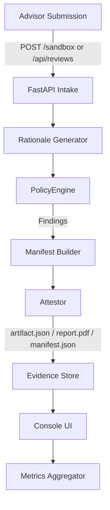

# Architecture Overview — Quantum-Secure Compliance Copilot

- **FastAPI Intake** — Handles forms and JSON requests, normalises payloads, and updates funnel metrics.
- **Rationale Generator** — Deterministic text builder to seed audit trails without LLM drift.
- **PolicyEngine** — Python mirror of Rego policies evaluating 12 rules per submission.
- **Attestor** — Produces hashed manifest, PQC signature, PDF summary, and JSON artifact.
- **Evidence Store** — File-system backed bundles (`data/quantum_copilot/bundles/<case>`).
- **Console UI** — Jinja templates rendering live case outcomes and download links.
- **Metrics Aggregator** — Builds approval rates, PQC usage, latency, and funnel counts for the landing page.
