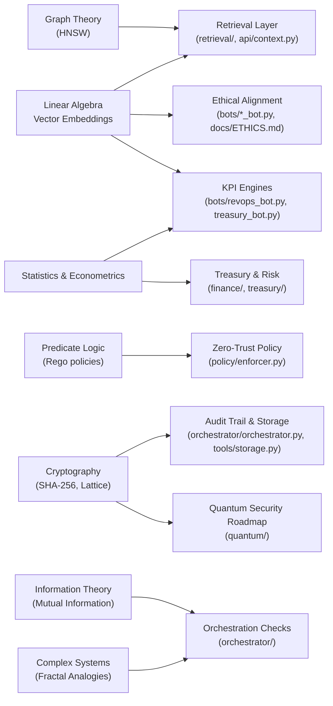

# Math Topology Map

This document summarizes how core mathematical disciplines weave through the **blackroad-prism-console** architecture.  It complements the narrative overview by giving a system-level view that engineers and auditors can use when tracing requirements, implementations, and assurance artifacts.

## Legend

- **Field** nodes refer to primary mathematical domains.
- **Subsystem** nodes represent major code groupings or workflows.
- Directed edges indicate the mathematical tools applied to power each subsystem.

## Field to Subsystem Mapping

| Mathematical Field | Representative Constructs | Key Modules / Files | Assurance Objective |
| --- | --- | --- | --- |
| Linear Algebra | Cosine similarity, Euclidean distance | `bots/*_bot.py`, `retrieval/`, `api/context.py` | Measure compliance vectors, drive retrieval scoring. |
| Graph Theory | Hierarchical Navigable Small World (HNSW) | `retrieval/`, Qdrant integration | Achieve sub-linear similarity search for RAG. |
| Statistics & Econometrics | Expected value, CAPM, portfolio variance | `bots/treasury_bot.py`, `bots/finops_cost_opt_bot.py`, `finance/` | Model risk-return trade-offs and KPI forecasting. |
| Predicate Logic | Policy predicates, allow/deny decisions | `policy/enforcer.py` | Encode zero-trust controls as provable logic. |
| Cryptography | SHA-256 hashing, LWE references | `orchestrator/orchestrator.py`, `tools/storage.py`, `quantum/` | Ensure immutable audit chains; prepare for post-quantum security. |
| Information Theory | Mutual information, entropy minimization | `orchestrator/`, `redteam/`, `metrics.py` | Align bot outputs with task intent while constraining uncertainty. |
| Complex Systems | Mandelbrot iteration metaphors | `docs/`, commit history references | Frame iterative audits as bounded dynamical systems. |

## Usage Patterns

1. **Design Reviews** – Use the diagram to confirm that new modules inherit the appropriate mathematical guarantees (for example, extending the RAG layer should reference both linear algebra and graph theory nodes).
2. **Audit & Compliance** – The field mapping table highlights which files provide mathematical assurance artifacts for regulators or internal audits.
3. **Roadmapping** – Quantum placeholders remain disconnected until the Phase I modules land; linking them ensures we track dependencies before implementing BB84 or lattice cryptography.

## Extending the Map

- When adding a new subsystem, add a new node under "Subsystem" and connect it to the mathematical fields it depends on.
- Annotate the table with additional constructs (e.g., control theory) if a feature introduces new analytical methods.
- Keep module references specific—use fully qualified paths to help reviewers and auditors cross-check implementations quickly.

---

*Maintainer tip:* During design reviews, capture any deviations between the intended math model and the implemented code so that the map remains a source of truth for compliance and assurance workflows.
